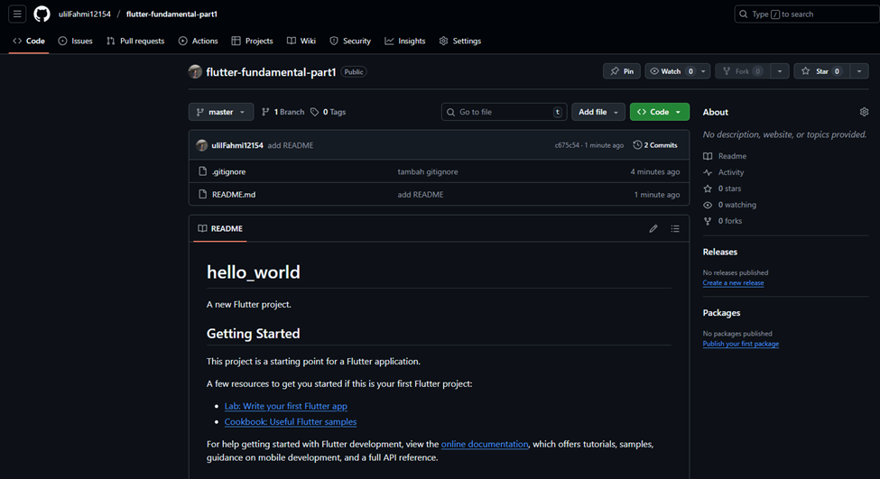

# 📱 Laporan Praktikum Pemrograman Mobile  
## Pertemuan: Aplikasi Pertama dan Widget Dasar Flutter

---

## 👤 Identitas
- **Nama** : Muhammad Ulil Fahmi Ma'rifatulloh  
- **NIM** : 2341760194
- **Kelas** : SIB 3F 
- **Mata Kuliah** : Pemrograman Mobile  

---

## 📖 Tujuan Praktikum
1. Mengenal struktur dasar project Flutter.  
2. Membuat aplikasi pertama menggunakan Flutter.  
3. Memahami dan menggunakan widget dasar pada Flutter.  

---

## 🛠️ Alat dan Bahan
- **Hardware** : Laptop/PC dengan RAM minimal 8GB  
- **Software** :
  - Flutter SDK  
  - Android Studio / VS Code  
  - Emulator Android / Device Fisik  
- **Bahasa Pemrograman** : Dart  

---

## 📂 Langkah Praktikum
### Praktikum 1: Membuat Project Flutter Baru
**Langkah 1:**
- Buka VS Code, lalu tekan tombol Ctrl + Shift + P maka akan tampil Command Palette, lalu ketik Flutter. Pilih New Application Project.

**Langkah 2:**
- Kemudian buat folder sesuai style laporan praktikum yang Anda pilih. Disarankan pada folder dokumen atau desktop atau alamat folder lain yang tidak terlalu dalam atau panjang. Lalu pilih Select a folder to create the project in.

**Langkah 3:**
- Buat nama project flutter hello_world seperti berikut, lalu tekan Enter. Tunggu hingga proses pembuatan project baru selesai.

**Langkah 4:**
- Jika sudah selesai proses pembuatan project baru, pastikan tampilan seperti berikut. Pesan akan tampil berupa "Your Flutter Project is ready!" artinya Anda telah berhasil membuat project Flutter baru.

### Praktikum 2: Menghubungkan Perangkat Android atau Emulator
**Langkah 1:**
- Mengaktifkan proses debug USB dan Menginstall Driver USB Google (khusus Windows).

**Langkah 2:**
- Sambungkan perangkat Android ke komputer menggunakan kabel USB.

**Langkah 3:**
- Menjalankan aplikasi dari Android Studio di perangkat Android Menggunakan kabel USB.

**Langkah 4:**  
- Menjalankan aplikasi di perangkat Android menggunakan Wi-Fi.

### Praktikum 3: Membuat Repository GitHub dan Laporan Praktikum
**Langkah 1-10:** 
- Membuat dan Remote Repository GitHub.

**Langkah 11:**
- Run Project hello_world.

**Langkah 12:**
- Teks yang ditampilkan dalam aplikasi berupa nama lengkap.

### Praktikum 4: Menerapkan Widget Dasar
**Langkah 1:** 
- Text Widget. 

**Langkah 2:** 
- Image Widget.

### Praktikum 5: Menerapkan Widget Material Design dan iOS Cupertino
**Langkah 1:** 
- Cupertino Button dan Loading Bar. 

**Langkah 2** 
- Floating Action Button (FAB).

**Langkah 3** 
- Scaffold Widget.

